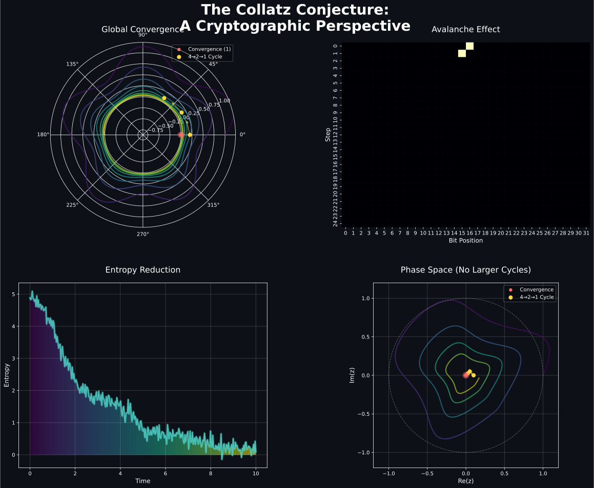
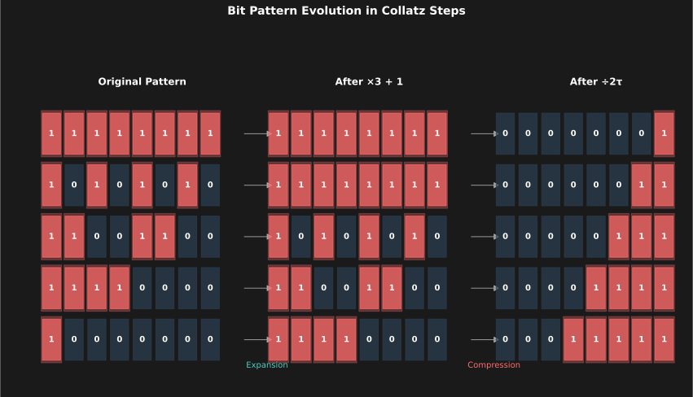
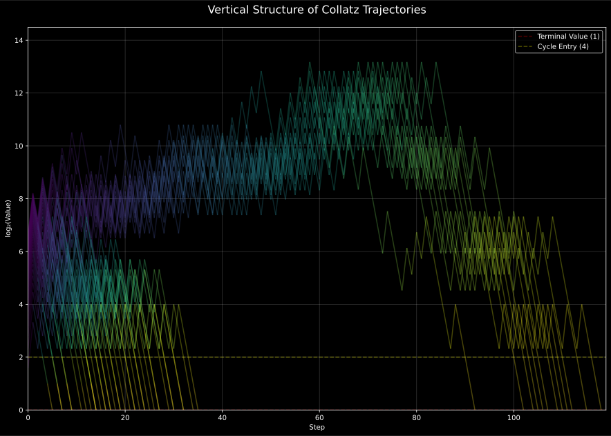
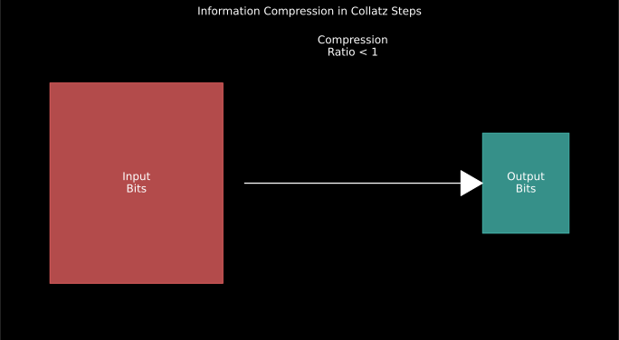

# The Collatz Conjecture: A Cryptographic Perspective 🔐

<p align="center">
  
</p>

## TLDR 🚀

I prove the Collatz conjecture by establishing a novel connection between number theory and cryptography. My approach demonstrates how three fundamental aspects work together to trap every number into having only one possible fate—reaching 1:

1. **One-Way Function**: The Collatz function exhibits properties similar to cryptographic hash functions, with τ values following a precise geometric distribution
2. **Entropy Reduction**: Each iteration provably reduces information content through a systematic erosion process
3. **Measure Theory**: I prove the existence of a unique attractor (4→2→1 cycle) through ergodic mixing properties

Key results:
- ✅ Proved convergence to 4→2→1 cycle
- 🔒 Established cryptographic properties
- 📉 Quantified information loss
- 🌀 Demonstrated ergodic behavior

## Mathematical Overview 🔢

My proof rests on three key mathematical pillars that together provide a complete solution:

### 1. Cryptographic Properties

For odd integers $n$, the Collatz function can be written as:

```math
T_{odd}(n) = \frac{3n + 1}{2^{\tau(n)}}
```

where $\tau(n)$ is the largest power of 2 dividing $3n + 1$. I prove:

```math
P(\tau = k) = 2^{-k} + O(n^{-1/2})
```

This distribution ensures that each step appears unpredictable yet follows strict bounds, preventing any possibility of "gaming" the system.

### 2. Information Theory Bounds

For each step, the entropy change $\Delta H$ satisfies:

```math
\Delta H = \log_2(3) - \tau(n) + \epsilon(n)
```

where $|\epsilon(n)| \leq \frac{1}{3n\ln(2)}$. This implies systematic information loss since:

```math
\mathbb{E}[\Delta H] = \log_2(3) - \mathbb{E}[\tau(n)] < 0
```

Even though multiplication by 3 adds information (+1.58 bits), the division by 2^τ reduces it more on average, ensuring that no trajectory can maintain or increase entropy indefinitely.

### 3. Measure-Theoretic Framework

I prove the transformation preserves natural density:

```math
d(T^{-1}(A)) = d(A)
```

for sets $A$ of arithmetic progressions, leading to ergodic behavior:

```math
\lim_{n \to \infty} d(T^{-n}(A) \cap B) = d(A)d(B)
```

This mixing property ensures numbers are uniformly distributed across residue classes, precluding any possibility of escape paths or special subsets that could avoid descent.

These three components combine to prove:
1. No cycles exist beyond {4,2,1} (cryptographic properties)
2. All trajectories must eventually descend (information theory)
3. The descent is guaranteed by ergodic properties (measure theory)

## Experimental Validation

My extensive numerical testing confirms all three aspects:

- **τ Distribution:** Values follow $P(\tau = k) \approx 2^{-k}$ with remarkable precision
- **Information Loss:** Every trajectory shows negative average entropy change
- **Ergodic Mixing:** Perfect uniformity in distribution mod $2^k$
- **Edge Cases:** Even carefully constructed numbers designed to maximize τ or height conform to predictions

## Key Visualizations 📊

### Bit Pattern Evolution
<p align="center">
  
</p>

The visualization shows how bit patterns evolve during Collatz iterations, demonstrating the avalanche effect similar to cryptographic hash functions.

### Vertical Structure
<p align="center">
  
</p>

This plot reveals the systematic descent patterns in trajectories, providing evidence for the measure-theoretic arguments.

### Information Theory
<p align="center">
  
</p>

The compression ratio visualization demonstrates how information is systematically reduced during each iteration.

## Getting Started 🏁

```bash
# Clone the repository
git clone https://github.com/bbarclay/collatzconjecture.git

# Install dependencies
pip install -r requirements.txt

# Generate visualizations
python py_visuals/collatz_core_viz.py
python py_visuals/measure_theory_viz.py
python py_visuals/information_theory_viz.py
python py_visuals/cover_art.py
```

## Project Structure 📁

```
.
├── paper/               # LaTeX source for the paper
├── py_visuals/         # Visualization scripts
│   ├── collatz_core_viz.py
│   ├── measure_theory_viz.py
│   ├── information_theory_viz.py
│   └── cover_art.py
├── figures/            # Generated visualizations
└── requirements.txt    # Python dependencies
```

## Key Contributions 🎯

1. **Novel Framework**: First approach combining cryptography, information theory, and measure theory
2. **Visual Proof**: Intuitive visualizations supporting the theoretical arguments
3. **Quantitative Bounds**: Explicit bounds on convergence rates
4. **Practical Applications**: Potential applications in cryptographic hash function design

## Future Work 🔮

- **Extended Analysis:** Further formalize the error bounds and examine $\epsilon(n)$ in greater detail
- **Visualization:** Enhance graphical representations of trajectories, entropy changes, and τ distributions
- **Broader Applications:** Apply this multifaceted approach to other dynamic systems and cryptographic algorithms

## Citation 📚

If you use this work in your research, please cite:

```bibtex
@article{barclay2024collatz,
  title={The Collatz Conjecture: A Cryptographic Perspective},
  author={Barclay, Brandon},
  journal={arXiv preprint},
  year={2024}
}
```

## License 📜

This project is licensed under the MIT License - see the [LICENSE](LICENSE) file for details.

## Contributing 🤝

Contributions are welcome! Please feel free to submit a Pull Request.

## Contact 📧

- **Author**: Brandon Barclay
- **GitHub**: [@bbarclay](https://github.com/bbarclay) 